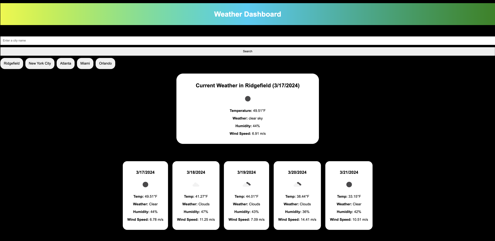

# Weather Dashboard

## Sceenshot of Application 

## Overview
The Weather Dashboard is a web application that provides users with current weather conditions and a 5-day forecast for any city they search for.

## Features
- Search for a city and view its current weather conditions.
- See a 5-day forecast for the searched city.
- View search history for easy access to previously searched cities.

## Usage
1. Enter the name of a city in the search input field.
2. Click the "Search" button to view the current weather and forecast for that city.
3. The current weather will be displayed in a box at the top of the page, and the 5-day forecast will appear below it.
4. You can click on a city in the search history to quickly view its weather again.

## Technologies Used
- HTML
- CSS
- JavaScript
- OpenWeatherMap API

## Link to webpage

https://spencerklink.github.io/Weather-DB/